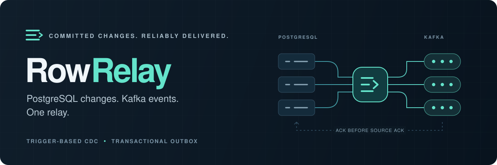

<p align="center">
  
</p>

<h1 align="center">PostgreSQL CDC &amp; transactional outbox for Kafka</h1>

<p align="center">
  Capture row changes. Publish business events. Keep the transaction boundary.<br>
  Written in Go. No logical replication or PostgreSQL <code>REPLICATION</code> privilege required.
</p>

<p align="center">
  <a href="https://github.com/sleepkqq/row-relay/actions/workflows/ci.yml"></a>
  <a href="https://github.com/sleepkqq/row-relay/releases/latest"></a>
  <a href="https://github.com/sleepkqq/row-relay/pkgs/container/row-relay"></a>
  <a href="go.mod"></a>
  <a href="LICENSE"></a>
</p>

<p align="center">
  <a href="#quick-start">Quick start</a> ·
  <a href="docs/README.md">Documentation</a> ·
  <a href="#tested-not-just-promised">Evidence</a> ·
  <a href="https://github.com/sleepkqq/row-relay/releases">Releases</a> ·
  <a href="CONTRIBUTING.md">Contributing</a>
</p>

---

**RowRelay connects committed PostgreSQL transactions to Kafka.** Use trigger-based
change data capture (CDC) to observe database writes, or a transactional outbox to
publish application-defined events. Both use the same durable PgQue queue engine
and can run side by side in one process.

## Two ways in. One reliable way out.

| | Change data capture | Transactional outbox |
| --- | --- | --- |
| **Use it for** | Cache invalidation and row-change consumers | Domain events and service-to-service messaging |
| **Capture** | SQL triggers on registered tables, including writes outside your app | An enqueue call inside the business transaction |
| **Payload** | Full `OLD` / `NEW` images, typed Protobuf, explicit SQL NULLs and exact numbers | Your original Kafka key, wire bytes and ordered headers |
| **Consumer contract** | [CDC protocol](docs/protocol.md) | [Outbox protocol](docs/outbox.md) |

```text
                         PostgreSQL transaction
                     ┌────────────────────────────┐
  Row changes ──────► │ capture trigger            │
                     │                  ├─► PgQue │
  Business events ──► │ outbox.enqueue()            │
                     └──────────────────────┬─────┘
                                            │ committed events
                                            ▼
                                        RowRelay ─────► Kafka ─────► Consumers
                                            │             │
                                            ◄── Kafka ACK ┘
                                            │
                                        Source ACK
```

### Why RowRelay?

- **No WAL reader or replication slot.** Capture runs in the writing transaction;
  rollback also rolls back the event. Ordinary PostgreSQL durability WAL stays enabled.
- **At-least-once, with an explicit ACK boundary.** A source batch is acknowledged
  only after Kafka acknowledges every chunk. Ambiguous failures replay stable event IDs.
- **Preserve what consumers need.** CDC retains old keys, full row images and
  NULL/presence semantics. Outboxes preserve prepared Protobuf/Apicurio records byte for byte.
- **One binary, multiple streams.** Bounded CDC and outbox workers share a process,
  with independent source state and a separate producer per stream.
- **Explicit ownership and recovery.** The default fenced profile uses Kafka
  transactions and `read_committed` consumers. A managed profile supports brokers
  without transactional-ID permissions under its [documented constraints](docs/ownership.md).
- **Operational basics included.** TLS, SCRAM-SHA-512, health probes, a non-root
  container and a bundled, pinned PgQue installer.

## Quick start

### Run the released container

```sh
docker run --rm ghcr.io/sleepkqq/row-relay:1.1.0 --version
```

The image contains the relay, CA roots and the unmodified **PgQue 0.2.0** installer.
No Go toolchain or separate SQL download is needed.

### Publish a business outbox

Use a PostgreSQL database and a pre-created Kafka topic named `orders.events`.
Set `DATABASE_URL` and `KAFKA_BROKERS` to addresses **reachable from the container**.
For secured brokers, also pass the [Kafka TLS/SCRAM environment variables](docs/operations.md#kafka-transport).

**1. Install once**, using a database connection with installation rights:

```sh
docker run --rm -e DATABASE_URL \
  ghcr.io/sleepkqq/row-relay:1.1.0 --install-pgque

docker run --rm -e DATABASE_URL \
  ghcr.io/sleepkqq/row-relay:1.1.0 \
  --install --outbox-stream orders --topic orders.events
```

PgQue installation requires administrative rights; capture itself does not require
replication privileges. Installers refuse to overwrite existing installations.
Use the [separate application and publisher roles](docs/operations.md#postgresql-role-separation)
for runtime connections.

**2. Enqueue with your business write**, in the same database transaction:

```sql
BEGIN;

-- Perform your business INSERT / UPDATE here.
-- Supply bound parameters from your application; retain the ID on retry.
SELECT rowrelay_outbox.enqueue(
  'orders',
  $1::uuid,   -- stable delivery ID
  $2::bytea,  -- Kafka key, e.g. the order ID
  $3::bytea   -- serialized event, including any schema-registry framing
);

COMMIT;
```

**3. Start the relay**, with `DATABASE_URL` set to the publisher connection:

```sh
docker run --rm -e DATABASE_URL -e KAFKA_BROKERS \
  ghcr.io/sleepkqq/row-relay:1.1.0 \
  --outbox-stream orders --topic orders.events
```

The default profile requires Kafka transactional-ID permissions and consumers
configured with `isolation.level=read_committed`. Consumers must handle replay
idempotently. See the [outbox guide](docs/outbox.md) for headers, ordering, multiple
streams and managed delivery.

### Need row-level CDC instead?

After installing PgQue, initialize capture on your existing tables:

```sh
docker run --rm -e DATABASE_URL \
  ghcr.io/sleepkqq/row-relay:1.1.0 --install --tables public.orders
```

Create a **single-partition** CDC topic, register the
[`CacheCdcRecord` Protobuf schema](internal/cdcwire/cache_cdc.proto) under its
`<topic>-value` subject, and set `SCHEMA_REGISTRY_URL` to Apicurio's
Confluent-compatible `/apis/ccompat/v7` endpoint. Start with the publisher connection:

```sh
docker run --rm -e DATABASE_URL -e KAFKA_BROKERS -e SCHEMA_REGISTRY_URL \
  ghcr.io/sleepkqq/row-relay:1.1.0 --topic orders.cdc
```

Typed Protobuf is the default. Schema lookup is explicit; startup never registers
schemas or silently falls back to JSON. Read the [wire protocol](docs/protocol.md)
and [capture requirements](docs/operations.md) before connecting a consumer.

## Tested, not just promised

| Evidence | What was checked |
| --- | --- |
| [Two-hour outbox soak](docs/results/2026-09-19-outbox-soak.md) | **3,630,000 events** reconciled, including warm-up; zero missing, corrupt, phantom or duplicate events in that run; complete source ACK |
| [PgQue / pg-boss comparison](docs/results/2026-09-19-pgque-pgboss-screening.md) | 18 cases and **2.22 million events** reconciled; healthy/held-snapshot latency, resource use and backlog drain |
| [JVM / Apicurio interoperability](interop/jvm/README.md) | Real consumers, typed row values, prepared wire bytes and cold Registry failures |
| [Failure and recovery tests](docs/testing.md) | Rollbacks, late commits, lost ACK responses, replay, poison records and stale publishers |

These are workload-specific results, not universal throughput claims. The soak
used PostgreSQL 18.4, Kafka Native 4.3.0, a single broker with RF=1, fenced delivery
and Zstandard; shared-host interference is recorded in the report. Each report
documents its workload, versions, durability settings and limitations.

## Current scope

**Version 1.1.0 adds offline configuration validation and operational
diagnostics.** `--check-config` validates the effective configuration without
connecting to PostgreSQL, Kafka or the schema registry; timestamped startup,
retry, recovery and shutdown logs stay credential- and row-free; and readiness
follows real operation progress during long drains without certifying source
freshness. The 1.0.0 release established CDC, prepared outboxes, source-level
takeover and Go/JVM wire compatibility, which remain implemented and tested.
Production hardening and broader deployment acceptance remain tracked in the
[roadmap](tasks/todo.md).

- Delivery is **at-least-once**, not end-to-end exactly-once. Kafka ACK does not
  mean the consumer has applied the event.
- CDC supports logged ordinary tables with primary keys. Partitioned roots,
  views, keyless tables and captured-table `TRUNCATE` are not supported.
- One owner runs each source. Standby takeover is implemented; automatic stream
  sharding and horizontal throughput scaling are not.
- A poison record blocks its stream rather than being discarded. Other configured
  streams can continue.
- Readiness is operational health, not a consumer-freshness certificate. Closed
  CDC boundaries and cache adapters have [separate contracts](docs/progress.md).
- PgQue is the only supported queue backend. Managed-provider installation rights
  and production multi-broker failure acceptance must be verified for the target environment.

## Documentation

| Start here | Go deeper |
| --- | --- |
| [Documentation index](docs/README.md) | All guides, contracts and experiment reports |
| [Operations](docs/operations.md) | Installation, permissions, TLS/SCRAM, containers and probes |
| [Business outbox](docs/outbox.md) | Transactional ingress, wire bytes, routing and replay |
| [CDC protocol](docs/protocol.md) | Row semantics, Protobuf and Apicurio framing |
| [Ownership & recovery](docs/ownership.md) | Fencing, managed delivery and takeover boundaries |
| [Local lab](local/README.md) | Disposable PostgreSQL/Kafka, integration tests and benchmarks |

## Development & contributing

Requires **Go 1.27+** and Make. Integration tests additionally use Docker Compose;
resource measurements require Linux with cgroup v2.

```sh
git clone https://github.com/sleepkqq/row-relay.git
cd row-relay
make check
./bin/row-relay --version
```

`make check` verifies formatting, runs `go vet` and `go test -race`, and builds
the binary. Unit tests run without external infrastructure. For the disposable lab:

```sh
make fetch-pgque lab-up bench-build integration
make lab-down
```

Bug reports, integration feedback, documentation improvements and reproducible
benchmarks are welcome. Start with [CONTRIBUTING.md](CONTRIBUTING.md), browse the
[roadmap](tasks/todo.md), or [open an issue](https://github.com/sleepkqq/row-relay/issues/new/choose).

## License & acknowledgements

[Apache License 2.0](LICENSE) · Copyright 2026 sleepkqq.

Built with [PgQue](https://github.com/NikolayS/PgQue),
[pgx](https://github.com/jackc/pgx), [franz-go](https://github.com/twmb/franz-go)
and [Protocol Buffers](https://protobuf.dev/). Bundled third-party components
retain their own license notices.
